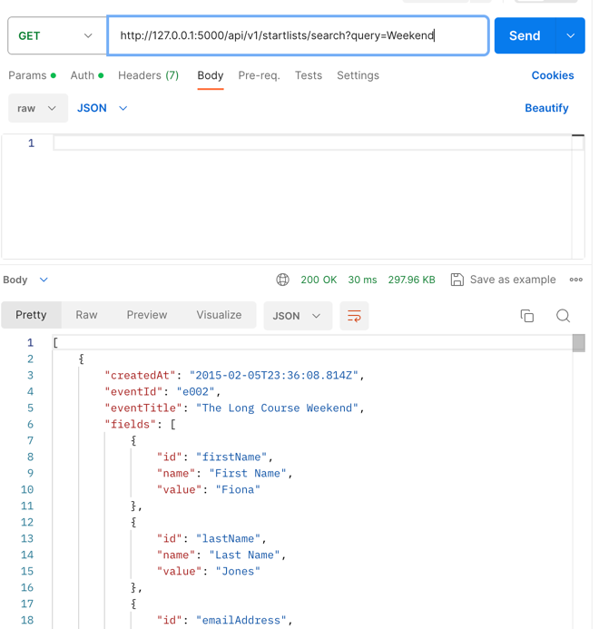

# Search and Pagination
The `/api/v1/startlists` endpoint will return all the existing startlists.

To move to the next page, simply add `?page=10` to the GET startlist endpoint:


# How to add an entry
Send a JSON object with POST request to this endpoint: `/api/v1/startlists/add`.


The JSON object must follow the following structure, and all the fields are required
```
    {
        "id": "xx",
        "eventId": "xx",
        "raceId": "xx",
        "ticketId": "xx",
        "eventTitle": "xx race",
        "raceTitle": "xx",
        "ticketTitle": "xx Ticket",
        "createdAt": "2022-11-27T01:20:57.371Z",
        "updatedAt": "2023-01-21T11:15:51.236Z",
        "fields": [
            {
                "id": "xx",
                "name": "xx",
                "value": "xx"
            }
        ]
    }
```
# How to delete an entry
Send a DELETE request to this endpoint specifying the id: `/api/v1/startlists/delete/<id>`.


# How to search for specific entries
1. Send a GET request to this endpoint with query param: `/api/v1/startlists/search?query=Weekend`.
It will return any matching entries.



2. Send a GET request to this endpoint with `id`: `/api/v1/startlists/search/<id>`.


# Context

Before an event occurs, an event organiser needs to have a list of all the participants who are taking part in their event and which race they are running in. This list is called a "race startlist".
When someone makes a booking through our site, we need to collect all their relevant information and display it to our event organisers in a clear, easy to read format.

# The Data

We have prepared a JSON document for you that contains a set of race startlist records. The data can be found in this repo, in the `startlists.json` file.

We'd like you to create an API that exposes this dataset. You can use the JSON document as a replacement for a database, or add the data to a database if you'd prefer, but please don't feel you have to — spinning up a database isn't a particularly interesting use of your time!

We'd like you to add the following functionality to the API:

- Query for all the race startlist data in the dataset
- Add an API for adding new race startlist entries to the dataset
- Add queries to search and filter data from the dataset
- Add in pagination to be used by a client that supports infinite scrolling

# Submitting

Remember that when you send the test back, you can feel free to include any information about what you didn't do that you would have liked to, where you cut corners (and why) etc.

It’s unlikely you'll complete everything as perfectly as you would have liked, so please do feel free to add any colour through comments or notes!

Good luck!
